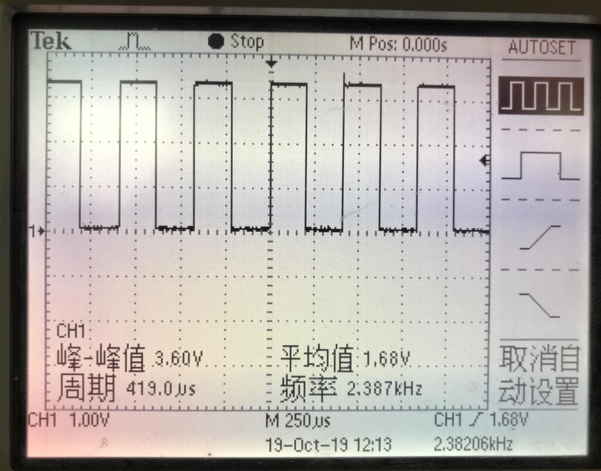

# 使用rt-thread hwtimer+thread分层方式驱动步进电机

## 简介

本文档以 野火霸道 STM32F103 开发板的 BSP (板级支持包) 为基础，编程实现了一种步进电机驱动的方式。

主要内容如下：

- 实现原理
- 函数说明
- 运行结果


## 实现原理

步进电机的驱动是通过脉冲控制，每接收一个脉冲，就会转动一步。

如我们需要产生一个1kHz的脉冲，通过启动一个500us周期的硬件定时器，时间到了之后在中断服务函数中进行IO翻转，就可以实现简单的脉冲输出。

由于步进电机控制需要输出指定脉冲数，在计算剩余步数等操作的时候，可能会消耗大量时间，如果全都放在中断服务函数中，可能会影响系统的实时性，于是这里的中断服务函数中，仅发出一个事件，剩余工作交由另外一个线程去做处理。

## 函数说明
+ `static void sp1_run_thread_entry(void *parameter)` ：运行时处理IO翻转等事宜、剩余脉冲计算等事宜。
+ `static rt_err_t sp1_timeout_callback(rt_device_t dev, rt_size_t size)` ：中断回调函数，发送事件通知线程`sp1_run_thread_entry`进行翻转操作。
+ `static int sp1_sample(int argc, char *argv[])` ：对流程中需要用到的事件、互斥量、线程及定时器进行初始化操作，修改 `timeout_s` 的值即可实现定时器周期的修改。
+ `static int set_target(int argc, char *argv[])` ：设置目标位置，通过对比`target_pos`和`current_pos`，修改方向和产生脉冲数。
+ `static int get_value(int argc, char *argv[])` ：获取当前位置和目标位置。
+ `static void test1_therad_entry(void *parameter)` ：到达目标位置后，自动增加目标位置的设置程序。
+ `static int test_run(int argc, char *argv[])` ：两路脉冲输出的测试程序，即直接创建线程`test1_therad_entry`和`test2_therad_entry`


## 运行结果

下载程序成功之后，系统会自动运行，连接开发板对应串口到 PC , 在终端工具里打开相应的串口（115200-8-1-N），复位设备后，可以看到 RT-Thread 的输出信息:

```bash
 \ | /
- RT -     Thread Operating System
 / | \     4.0.0 build Oct 19 2019
 2006 - 2018 Copyright by rt-thread team
msh > 
```

输入 `sp1_sample`，系统会启动以1s的周期启动`timer4`，随后输入 `set_target 10` ，则对应着`SP1_PULSE`的引脚会输出0.5Hz为周期的10个脉冲。


## 注意事项

可以通过`rt_device_write(sp1_hwtimer, 0, &timeout_s, sizeof(timeout_s)) != sizeof(timeout_s)`重新修改定时器的周期，以此来改变占空比的值。
通过测试发现，当定时器周期为` 29us`时，运行`sp1_sample`后，msh无响应。
当定时器周期为` 49us`时，运行`sp1_sample`后，设置目标坐标`set_target 999999999`，示波器可以看到10kHz频率的方波，而此时的msh打印线程信息已经明显可以赶感觉到卡顿了。
```bash
thread   pri  status      sp     stack size max used left tick  error
-------- ---  ------- ---------- ----------  ------  ---------- ---
th_sp1     3  suspend 0x000000ac 0x00000400    16%   0x00000007 000
tshell    20  ready   0x00000190 0x00001000    14%   0x00000006 000
tidle0    31  ready   0x00000040 0x00000100    31%   0x0000000d 000
main      10  suspend 0x00000060 0x00000800    10%   0x00000011 000
```
为了支持多步进电机使用，复制粘贴代码生成两路脉冲输出。

使用`test1_therad_entry`动态增加目标位置，设置周期为`199us`即2.5kHz，波形如下：

明显可以看出，输出速度已经跟不上了。
如果需要动态修改输出速度，如步进电机加减速，此程序仅可用于2kHz以内频率双通道输出。
单通道固定值不调速的话，可输出10kHz以内的频率，这个频率对于步进电机来说已经很快了。

## 联系人信息

维护人:

- [ShineRoyal](https://github.com/ShineRoyal) 

